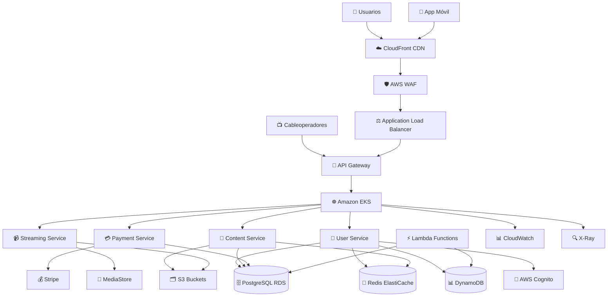

# Arquitectura de la Solución CNN Chile

## Resumen Ejecutivo

Este documento describe la arquitectura de la plataforma digital modernizada de CNN Chile, diseñada para aumentar la audiencia nacional e internacional mediante una infraestructura escalable, segura y completa en AWS.

## Objetivos de Negocio

- ✅ Aumentar las visitas del sitio web
- ✅ Incrementar el tiempo de uso de la aplicación móvil
- ✅ Integrar con cableoperadores chilenos para validación de usuarios
- ✅ Permitir registro de usuarios internacionales
- ✅ Manejar suscripciones con Stripe
- ✅ Implementar CMS moderno con registro de usuarios
- ✅ Sistema de notificaciones multi-canal
- ✅ Cumplimiento de normativas de protección de datos
- ✅ Gestión MAM (Media Asset Management)
- ✅ CDN para contenido estático y streaming

## Arquitectura General

## Componentes de la Arquitectura

### 1. Frontend y CDN

#### CloudFront Distribution
- **Propósito**: Distribución global de contenido estático y streaming
- **Características**:
  - Dos distribuciones separadas (estática y media)
  - Lambda@Edge para autenticación y geo-restricciones
  - Caché optimizado para diferentes tipos de contenido
  - Soporte para HLS/DASH streaming

#### Dominios
- `cnnchile.com` - Sitio principal
- `api.cnnchile.com` - API endpoints
- `static.cnnchile.com` - Contenido estático
- `media.cnnchile.com` - Contenido multimedia
- `stream.cnnchile.com` - Streaming en vivo

### 2. Seguridad y Autenticación

#### AWS WAF
- **Configuración**: Dos Web ACLs separadas
  - CloudFront WAF: Rate limiting, geo-restrictions, SQL injection protection
  - ALB WAF: API-specific protections
- **Reglas Implementadas**:
  - Rate limiting por IP
  - Protección contra inyección SQL
  - Lista de reputación IP de Amazon
  - Restricciones geográficas para contenido premium

#### AWS Cognito
- **User Pool**: Gestión centralizada de usuarios
- **Identity Pool**: Federación de identidades
- **Características**:
  - MFA opcional
  - OAuth2/JWT tokens
  - Integración con Google y Facebook
  - Lambda triggers personalizados
  - Políticas de contraseñas robustas

### 3. Microservicios Backend

#### Amazon EKS
- **Configuración**: Cluster managed con node groups escalables
- **Características**:
  - Auto-scaling horizontal y vertical
  - Network policies para seguridad
  - Service mesh con Istio (opcional)
  - Logging centralizado

#### Microservicios Implementados

##### API Gateway
- Enrutamiento de requests
- Rate limiting
- Authentication middleware
- CORS handling

##### User Service
- Gestión de usuarios y perfiles
- Autenticación y autorización
- Integración con cableoperadores
- Gestión de suscripciones

##### Content Service
- Gestión de noticias y artículos
- CMS backend
- Búsqueda y filtrado
- Caché de contenido

##### Streaming Service
- Gestión de contenido multimedia
- Validación de acceso por región
- Integración con MediaStore
- Transcodificación de video

##### Payment Service
- Integración con Stripe
- Gestión de suscripciones
- Facturación automática
- Reportes financieros

### 4. Bases de Datos y Almacenamiento

#### Amazon RDS (PostgreSQL)
- **Propósito**: Datos transaccionales y financieros
- **Características**:
  - Multi-AZ para alta disponibilidad
  - Backup automático
  - Cifrado en reposo
  - Performance Insights

#### DynamoDB
- **Tablas Implementadas**:
  - Users: Datos de usuario por región (GDPR compliance)
  - Sessions: Gestión de sesiones
  - Subscriptions: Datos de suscripción
  - Analytics: Eventos de usuario
  - Content: Metadatos de contenido
  - Media Assets: Sistema MAM

#### ElastiCache (Redis)
- **Propósito**: Caché de sesiones y datos frecuentes
- **Configuración**: Cluster con failover automático

#### Amazon S3
- **Buckets**:
  - `media-content`: Videos, imágenes, documentos
  - `static-content`: Assets del sitio web
  - `live-streaming`: Archivos de streaming temporal

### 5. Servicios Serverless

#### AWS Lambda
- **Notification Service**: Manejo multi-canal de notificaciones
- **Event Processor**: Procesamiento de eventos del sistema
- **Cognito Triggers**: Lógica personalizada de autenticación
- **Lambda@Edge**: Funciones en el borde de la CDN

#### Amazon EventBridge
- Orchestración de eventos
- Integración con servicios externos
- Triggers automáticos

### 6. Streaming y Media

#### AWS MediaStore
- Almacenamiento optimizado para streaming en vivo
- Integración con CloudFront
- Soporte para protocolos HLS/DASH

#### AWS Elemental MediaLive (Opcional)
- Transcodificación en tiempo real
- Múltiples bitrates
- Inserción de anuncios

### 7. Monitoreo y Observabilidad

#### Amazon CloudWatch
- Métricas personalizadas
- Dashboards ejecutivos
- Alarmas automáticas
- Log aggregation

#### AWS X-Ray
- Trazabilidad distribuida
- Análisis de performance
- Detección de cuellos de botella

## Cumplimiento de Normativas

### GDPR (Unión Europea)
- Sharding de datos por región
- Cifrado end-to-end
- Right to be forgotten implementation
- Consent management

### CCPA (Estados Unidos)
- Transparencia en recolección de datos
- Opt-out mechanisms
- Data deletion requests

### Ley de Protección de Datos de Chile
- Datos locales para usuarios chilenos
- Audit trails
- Notification requirements

## Escalabilidad y Rendimiento

### Auto Scaling
- **EKS Nodes**: Escalado automático basado en CPU/memoria
- **Pods**: HPA (Horizontal Pod Autoscaler)
- **Lambda**: Concurrencia automática
- **DynamoDB**: Billing mode pay-per-request

### Patrones de Resiliencia
- **Circuit Breaker**: Prevención de cascadas de fallos
- **Retry Logic**: Reintentos exponenciales
- **Bulkhead**: Aislamiento de servicios críticos
- **Health Checks**: Monitoreo proactivo de servicios

### Optimizaciones de Performance
- **CDN Caching**: Múltiples niveles de caché
- **Database Indexing**: Índices optimizados
- **Connection Pooling**: Reutilización de conexiones
- **Compression**: Compresión de assets

## Seguridad Implementada

### Network Security
- VPC con subnets privadas/públicas
- Security Groups restrictivos
- Network ACLs
- NAT Gateways para salida segura

### Data Security
- Cifrado en tránsito (TLS 1.2+)
- Cifrado en reposo (AES-256)
- AWS Secrets Manager
- IAM roles con least privilege

### Application Security
- OWASP Top 10 compliance
- Input validation
- SQL injection prevention
- XSS protection headers

## Costos y Optimización

### Estrategias de Optimización
- Reserved Instances para cargas predecibles
- Spot Instances para procesamiento batch
- S3 Intelligent Tiering
- CloudWatch Logs retention policies

### Monitoreo de Costos
- AWS Cost Explorer integration
- Budget alerts
- Resource tagging strategy
- Regular cost reviews
