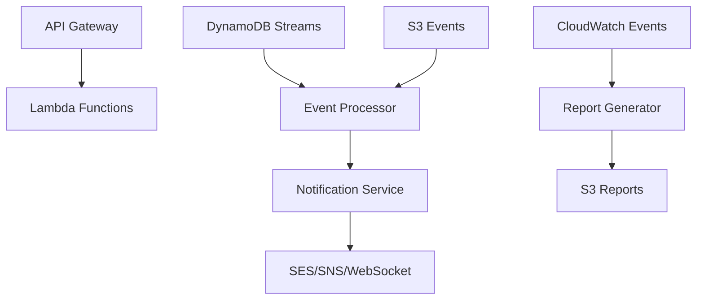

# Lambda Functions for CNN Chile Platform

Este directorio contiene las funciones Lambda serverless que manejan el procesamiento de eventos automatizados y notificaciones para la plataforma CNN Chile.

## Funciones Disponibles

### 1. Notification Service (`notification-service/`)
- **Propósito**: Manejo centralizado de notificaciones multi-canal
- **Triggers**: SQS, SNS, EventBridge
- **Funcionalidades**:
  - Envío de emails transaccionales
  - Notificaciones push móviles
  - Mensajes SMS
  - Notificaciones WebSocket en tiempo real

### 2. Event Processor (`event-processor/`)
- **Propósito**: Procesamiento de eventos del sistema y automatización
- **Triggers**: DynamoDB Streams, S3 Events, SQS
- **Funcionalidades**:
  - Procesamiento de registros de usuario
  - Manejo de suscripciones y expiración
  - Alertas de noticias de último momento
  - Invalidación de cache automática

### 3. Report Generator (`report-generator/`)
- **Propósito**: Generación automatizada de reportes analíticos
- **Triggers**: CloudWatch Events (scheduled)
- **Funcionalidades**:
  - Reportes de audiencia diarios/mensuales
  - Análisis de contenido más popular
  - Métricas de suscripciones
  - Reportes financieros

## Arquitectura Serverless

## Variables de Entorno Requeridas

### Notification Service
- `AWS_REGION`: Región de AWS
- `FROM_EMAIL`: Email remitente por defecto
- `PUSH_TOPIC_ARN`: ARN del tópico SNS para push notifications
- `WEBSOCKET_ENDPOINT`: Endpoint del WebSocket API Gateway

### Event Processor
- `NOTIFICATION_LAMBDA_ARN`: ARN de la función de notificaciones
- `ANALYTICS_TABLE`: Nombre de la tabla de analytics
- `USERS_TABLE`: Nombre de la tabla de usuarios

### Report Generator
- `REPORTS_BUCKET`: Bucket S3 para almacenar reportes
- `DATABASE_SECRET_ARN`: ARN del secret con credenciales de base de datos

## Despliegue

Las funciones Lambda se despliegan automáticamente como parte de la infraestructura Terraform. Cada función incluye:

- Configuración de IAM roles y políticas
- Variables de entorno desde AWS Secrets Manager
- Triggers y event sources configurados
- Monitoreo y logging con CloudWatch
- Dead letter queues para manejo de errores

## Monitoreo y Alertas

- **CloudWatch Metrics**: Métricas automáticas de invocaciones, errores y duración
- **X-Ray Tracing**: Trazabilidad distribuida habilitada
- **CloudWatch Alarms**: Alertas por errores y latencia alta
- **Dead Letter Queues**: Manejo de mensajes fallidos
